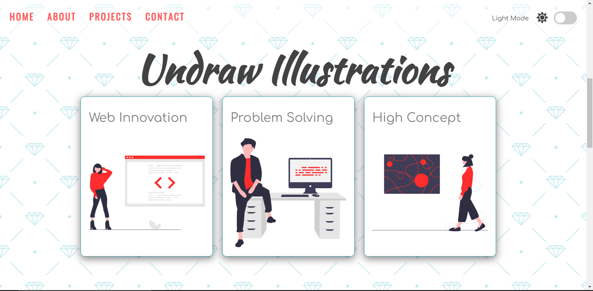
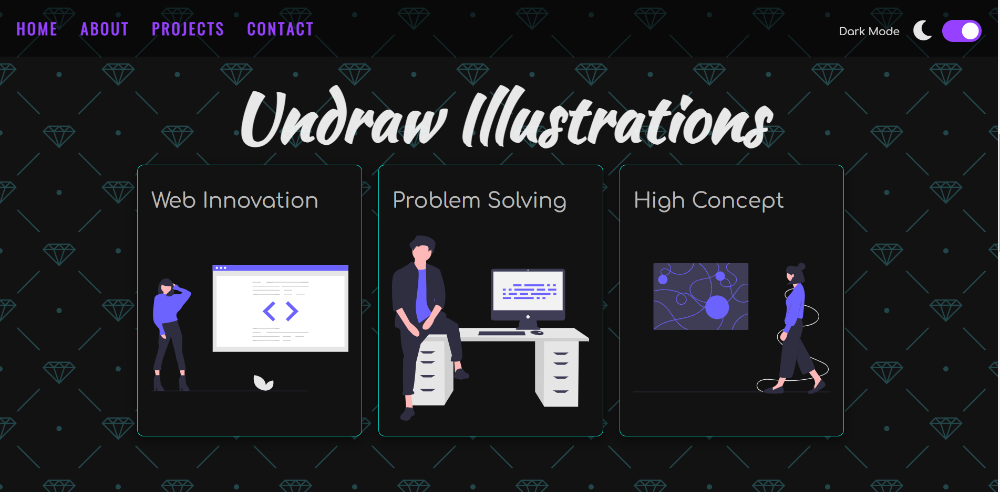

# light_dark_mode

## Description

An example of a template site that has a light dark theme toggle. The toggle changes the colors of the backgrounds, text and the SVG illustrations, the nav menu text color and hover effect, the toggle button text and icon. The site also uses local storage to save the users preference so that the next time the user returns to the site it display the color theme that the user prefers. The site is not responsive as for this project I was concentrating on just getting the light dark theme to function with the different elements on the page.

## Demo

A demo of the project can be found at: https://tod619.github.io/light_dark_mode/
